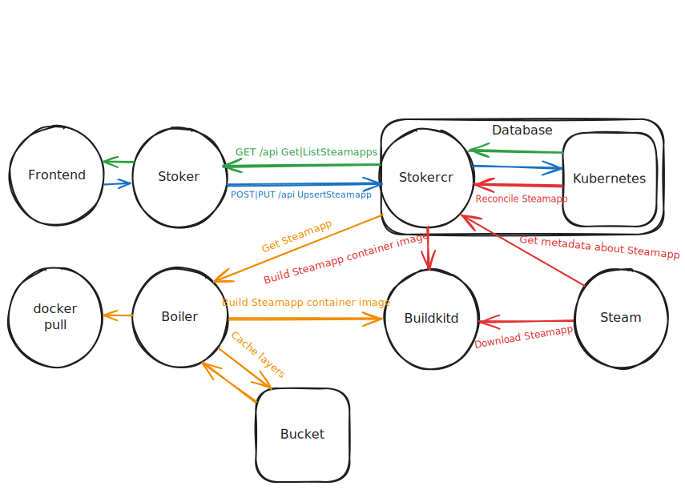

# Developing

## Prerequisites

[`go` 1.24](https://go.dev/doc/install), [`docker`](https://docs.docker.com/engine/install/), [`node` 20](https://nodejs.org/en/download), [`kubectl`](https://kubernetes.io/docs/tasks/tools/#kubectl) and a Kubernetes cluster.

## Running locally

If you want to develop the frontend without needing Stoker running, you can run the it with hot-reloading using builtin dummy data:

```sh
STOKER_URL=dummy:// yarn dev
```

If you want to develop (against) the backend, the first time you're running against a cluster or any time you change the types of a CRD, run:

```sh
make apply
```

Now you can the backend services against your cluster:

```sh
docker compose up --build stoker boiler migrate
```

The migrate service just initializes the cluster with some well-known Steamapps, so only needs ran once.

The boiler service is only necessary if you intend to `docker pull` a Steamapp image.

After its first run, you'll need to approve the Steamapps, otherwise they Stoker won't return them. This manual step is here to avoid running arbitrary code without validation during the build process.

```sh
go run ./cmd/kubectl-approve-steamapps --all
```

If you're developing the frontend, you can bring it up with hot-reloading, too:

```sh
yarn
STOKER_URL=http://localhost:5050/ yarn dev
```

## Components



### Boiler

A read-only container registry that builds the requested Steamapp container image on-demand and caches it for later. Boiler "contains Steam".

### Stoker

An API that handles CRUD for our Steamapp data model which contains the extra information necessary for Boiler to understand how to build a Steamapp's container image. Stoker "fuels Boiler".

## Glossary

### Read-only container registry

An HTTP(S) REST API from which you can `docker pull`, but not `docker push`

### Kubernetes resource

A piece of data, generally represented as YAML, which can be passed to `kubectl apply -f` to send as a request to a Kubernetes' cluster's kube-apiserver. Such objects contain the desired and actual state of the thing that they represent, the two of which can be out of sync, but are always being brought closer together. Some common, builtin examples are [Pods and ConfigMaps](https://kubernetes.io/docs/concepts/configuration/configmap/#configmaps-and-pods).

### Custom Resource Definition (CRD)

A Kubernetes resource which defines a new, custom kind of Kubernetes resource.

### Custom Resource (CR)

An instance of a CRD.

### Kubernetes controller

A service which connects to a Kubernetes cluster via its kube-apiserver, watches for events relating to a resource, and reacts to them to bring the desired and actual state of the thing that they represent closer together.

Synonomous with Kubernetes operator.

### Steamapp

A collection of files that can be downloaded from Steam via [`steamcmd +app_update`](https://developer.valvesoftware.com/wiki/SteamCMD#Downloading_an_App) and which has metadata retrievable from `steamcmd +app_info_print` that contains information about how to execute its entrypoint.

Often, said metadata contains insufficient information about how to execute the Steamapp's entrypoint, such as which system dependencies are necessary. To make up for this shortcoming, this term also refers to Sindri's data model which represents the extra information necessary to understand how to execute its files' entrypoint as well as the CRD that said data model is stored as.

## Repository structure

Sindri consists of two distinct technology stacks, both hosted at the root of the repository. The first is a Go module focused on tooling for building container images for Steamapps. The second is a [Remix](https://remix.run/) application that acts as a frontend to one of the services built from the Go module.

Like many of my projects, Sindri observes [gocloud.dev's URL concept](https://gocloud.dev/concepts/urls/) to inform a great deal of the code organization. That is, a package may declare an `interface` and even a `urlMux`. Subpackages then should be created to implement that `interface` one way and that subpackage may register its implementation in the parent's `urlMux`. For instance, [`github.com/frantjc/sindri/steamworkshopitem`](https://github.com/frantjc/sindri/tree/main/steamworkshopitem) is entirely dedicated to implemening [`github.com/frantjc/sindri.URLOpener`](https://github.com/frantjc/sindri/blob/main/url_opener.go).

New packages in Sindri may also indicate a new logical grouping of code. For instance, [`github.com/frantjc/sindri/contreg`](https://github.com/frantjc/sindri/tree/main/contreg) is exclusively dedicated to defining the HTTP portion of a read-only container registry.
